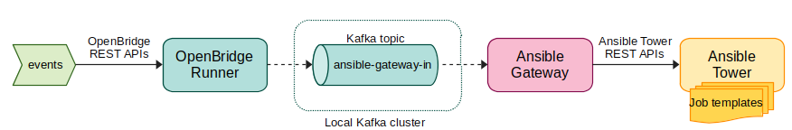

# Ansible Tower Integration

This document describes how to setup and run a single-machine system to demonstrate the integration between OpenBridge
and Ansible Tower.

This system allows to trigger [Ansible Tower job templates](https://docs.ansible.com/ansible-tower/latest/html/userguide/job_templates.html)
from events flowing through OpenBridge pipelines.

## Architecture



The diagram above gives a high level picture of the components that build this demo, which are:

1. A local Kafka cluster, run via [Docker Compose](https://docs.docker.com/compose/).
2. A local Ansible Tower instance, run via [Vagrant](https://www.vagrantup.com/).
3. A local OpenBridge instance configured with a bridge and at least one processor to match events that must trigger
   Ansible Tower job templates. How to configure it is described in the section below.
4. The Ansible Gateway: a Quarkus application that acts as bridge between OpenBridge and the Ansible Tower installation.
In the real world it is supposed to be deployed inside the customer infrastructure.

The flow of information is the following:

1. Events are published to the local OpenBridge instance via its REST APIs. In this document we are using [curl](https://curl.se/)
but whatever speaks REST can be used (e.g. [Postman](https://www.postman.com/)).
2. The OpenBridge instance processes events and, if some of them match, specific new events formatted as `{"job_template_id": $ID}`
are sent to a predetermined Kafka topic (in our case `ansible-gateway-in`). These events specify the ID (as integer) of the job template we want to trigger.
3. The Ansible Gateway listens for new events on the topic described above and, once a new one comes, it triggers the
corresponding job template in Ansible Tower via its REST APIs.

## Setup

### Prerequisites

To run this demo this guide assumes the machine has some tools installed:

- JDK (version >= 11) and Maven
- [Docker](https://docs.docker.com/engine/) and [Docker Compose](https://docs.docker.com/compose/)
- [Vagrant](https://www.vagrantup.com/) with [VirtualBox](https://www.virtualbox.org/) provider
- [curl](https://curl.se/) and [jq](https://stedolan.github.io/jq/)

### Kafka

Start `docker-compose` by running from the root directory of this repository:

```bash
docker-compose -f dev/docker-compose.yml up
```

This will start the Kafka cluster together with other services required to run OpenBridge (e.g. Keycloak for authentication).

When everything is up and running, create the `ansible-gateway-in` topic in the cluster. If you want to do it with a GUI, check out [Conduktor](https://www.conduktor.io/).

### Ansible Tower

From this folder, where the `Vagrantfile` is located, run:

```bash
vagrant up
```

and wait for the init process to complete. Then obtain the admin password by running:

```bash
vagrant ssh
```

The output should look like this and contain the credentials:

```
  Welcome to Ansible Tower!

  Log into the web interface here:

    https://10.42.0.42/

    Username: admin
    Password: <ADMIN_PASSWORD>

  The documentation for Ansible Tower is available here:

    http://www.ansible.com/tower/

  For help, visit  http://support.ansible.com/
```

***WARNING:** HTTPS **must** be used with the web interface. The local instance uses a self signed certificate, which browsers usually mark as insecure.
Ignore the warning and move on*.

`Vagrantfile` is configured to export the 443 port to 10443, so the interface is reachable
at `https://localhost:10443/`. With the credentials found above, log into the web interface.

The final step requires to follow the instructions shown after the first login to **obtain a
development subscription** and configure the license. Once completed, the Ansible Tower dashboard will be finally reachable.

### OpenBridge

To start the infrastructure, take a look at [this](/dev) folder

***WARNING:** the following requests contain some fixed example IDs. Change them with the ones returned by the real machine when running the demo.*

#### Obtain access token

For the following requests to be authenticated successfully, a valid access token must be obtained.

***WARNING:** the token will be valid for a few minutes, so this command must be executed again if OpenBridge APIs return a `401 Unauthorized` response.*

```bash
export AUTH_TOKEN=$(
    curl --location --request POST 'http://localhost:8180/auth/realms/event-bridge-fm/protocol/openid-connect/token' \
         --header 'Content-Type: application/x-www-form-urlencoded' \
         --data-urlencode 'username=admin' \
         --data-urlencode 'password=123' \
         --data-urlencode 'client_id=event-bridge' \
         --data-urlencode 'grant_type=password' | jq -r .access_token
)
```

#### Create Bridge

Let's create the bridge to send events to with this request:

```bash
curl --request POST 'http://localhost:8080/api/v1/bridges' \
     --header "Authorization: Bearer $AUTH_TOKEN" \
     --header 'Content-Type: application/json' \
     --data-raw '{"name": "ansible-gw_bridge"}'
```

The response should look like:

```json
{
    "kind": "Bridge",
    "id": "724439ac-a2ef-45e9-8b97-e6812afc0911",
    "name": "ansible-gw_bridge",
    "href": "/api/v1/bridges/724439ac-a2ef-45e9-8b97-e6812afc0911",
    "submitted_at": "2021-10-21T09:53:31.623948+0000",
    "status": "REQUESTED"
}
```

The bridge must be `AVAILABLE` in order to proceed. Run this request:

```bash
curl --request GET 'http://localhost:8080/api/v1/bridges/724439ac-a2ef-45e9-8b97-e6812afc0911' \
     --header "Authorization: Bearer $AUTH_TOKEN"
```

until the response looks like:

```json
{
    "kind": "Bridge",
    "id": "724439ac-a2ef-45e9-8b97-e6812afc0911",
    "name": "ansible-gw_bridge",
    "href": "/api/v1/bridges/724439ac-a2ef-45e9-8b97-e6812afc0911",
    "submitted_at": "2021-10-21T11:53:31.623948+0200",
    "status": "AVAILABLE",
    "endpoint": "/ingress/events/724439ac-a2ef-45e9-8b97-e6812afc0911"
}
```

The `endpoint` field contains the URL path to send events to.

#### Create Processor 

Let's create the processor that will send events to Ansible Gateway when it matches a specific filter:

```bash
curl --request POST 'http://localhost:8080/api/v1/bridges/724439ac-a2ef-45e9-8b97-e6812afc0911/processors' \
     --header "Authorization: Bearer $AUTH_TOKEN" \
     --header 'Content-Type: application/json' \
     --data-raw '{
         "name": "ansible-gw_process-status",
         "action": {
             "name": "ansible-gw_kafka-action",
             "parameters": {
                 "topic": "ansible-gateway-in"
             },
             "type": "KafkaTopicAction"
         },
         "filters": [
             {
                 "key": "type",
                 "type": "StringEquals",
                 "value": "ProcessStatusChange"
             }
         ],
         "transformationTemplate": "{\"job_template_id\":7}"
     }'
```

The response should look like:

```json
{
   "id": "4ac6a66b-44db-4804-ad11-4883e41d8f3f",
   "kind": "Processor",
   "href": "/api/v1/bridges/724439ac-a2ef-45e9-8b97-e6812afc0911/processors/4ac6a66b-44db-4804-ad11-4883e41d8f3f",
   "name": "ansible-gw_process-status",
   "bridge": {
      "kind": "Bridge",
      "id": "724439ac-a2ef-45e9-8b97-e6812afc0911",
      "name": "ansible-gw_bridge",
      "href": "/api/v1/bridges/724439ac-a2ef-45e9-8b97-e6812afc0911",
      "submitted_at": "2021-10-21T11:53:31.623948+0200",
      "status": "AVAILABLE",
      "endpoint": "/ingress/events/724439ac-a2ef-45e9-8b97-e6812afc0911"
   },
   "submitted_at": "2021-10-21T12:06:19.512847+0200",
   "status": "REQUESTED",
   "filters": [
      {
         "type": "StringEquals",
         "type": "StringEquals",
         "key": "type",
         "value": "ProcessStatusChange"
      }
   ],
   "transformationTemplate": "{\"job_template_id\":7}",
   "action": {
      "name": "ansible-gw_kafka-action",
      "type": "KafkaTopicAction",
      "parameters": {
         "topic": "ansible-gateway-in"
      }
   }
}
```

The processor must be `AVAILABLE` in order to proceed. Run this request:

```bash
curl --request GET 'http://localhost:8080/api/v1/bridges/724439ac-a2ef-45e9-8b97-e6812afc0911/processors/4ac6a66b-44db-4804-ad11-4883e41d8f3f' \
     --header "Authorization: Bearer $AUTH_TOKEN"
```

until the response looks like:

```json
{
   "id": "4ac6a66b-44db-4804-ad11-4883e41d8f3f",
   "kind": "Processor",
   "href": "/api/v1/bridges/724439ac-a2ef-45e9-8b97-e6812afc0911/processors/4ac6a66b-44db-4804-ad11-4883e41d8f3f",
   "name": "ansible-gw_process-status",
   ...
   "status": "AVAILABLE",
   ...
}
```

### Ansible Gateway

To start the Ansible Gateway, run these commands from the root of this repository:

```bash
export ANSIBLE_TOWER_AUTH_BASIC_PASSWORD=<ADMIN_PASSWORD>
mvn clean compile quarkus:dev -f use-cases/ansible-tower-integration/ansible-gateway/pom.xml
```

`ADMIN_PASSWORD` is the same password obtained when configuring Ansible Tower.

## Run

To run the demo, simply send events matching the processor to the bridge endpoint. These are test events made only for this demo. This is the request (change the endpoint 
according to the Bridge Ingress endpoint you have deployed):

```bash
curl --request POST 'http://<your_bridge_ingress_endpoint>/events' \
     --header 'Content-Type: application/json' \
     --data-raw '{
         "specversion": "1.0",
         "type": "VolumeSpaceCritical",
         "source": "DiskAgent",
         "id": "9ff2dbe3-dda0-4da6-870d-91a7b2c34d35",
         "time": "2019-11-18T15:13:39.4589254Z",
         "data": {
             "host": "webserver",
             "volume": "/dev/sda1",
             "usedPercentage": 98.945
         }
     }'
```

If everything goes well, once each of these requests is successfully received by OpenBridge, a new job instance of type `Demo Job Template` should
appear in the Jobs page of Ansible Tower dashboard. Verify by opening the page first and then sending new events.
